# ARCHITECTURE.md — Joliba

> Livrable §112. Les versions exactes des dépendances et leur compatibilité vivent dans
> [`docs/research/stack-compatibility.md`](docs/research/stack-compatibility.md).
> Le détail table par table vit dans [`DATA_MODEL.md`](DATA_MODEL.md).

---

## 1. Contexte système

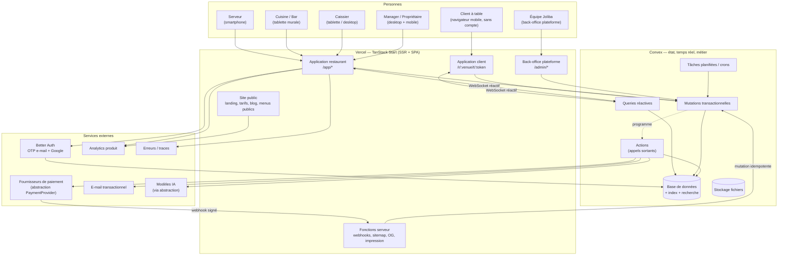

**Ce que ce schéma impose :**

- **Aucun secret côté navigateur.** Clés PSP, clés de modèles IA, clés e-mail : uniquement dans des
  *actions* Convex ou des fonctions serveur. Le client n'appelle jamais un tiers directement.
- **Les webhooks n'entrent pas par Convex directement** mais par une fonction serveur qui vérifie la
  signature, puis appelle une mutation **idempotente**. La vérification de signature exige le corps
  brut : c'est ce qui décide de ce point d'entrée.
- **Le temps réel n'est pas une option** : les écrans d'exploitation sont des abonnements Convex, pas
  des interrogations périodiques.

---

## 2. Modules

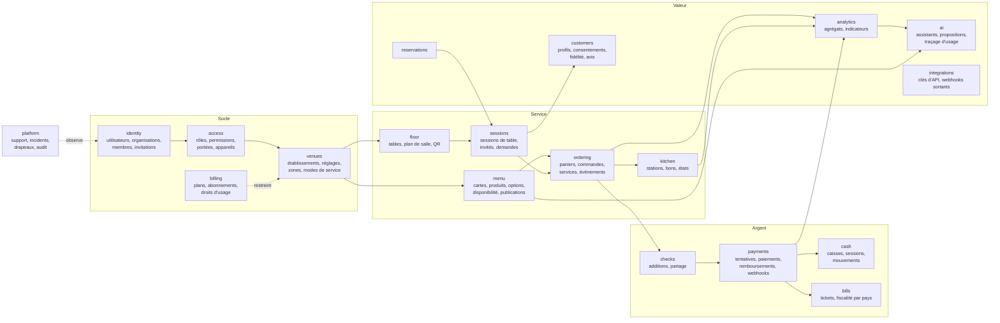

**Règles de dépendance, vérifiées en revue :**

1. Les flèches ne remontent jamais. `menu` ignore l'existence de `payments`.
2. Un module ne lit pas la table d'un autre : il passe par la fonction exposée par ce module.
3. `billing` **restreint** (droits d'usage), il n'accorde jamais — un bug d'abonnement ne doit pas
   ouvrir une porte (*PERMISSIONS.md §6*).
4. `platform` est isolé : garde distincte, permissions distinctes, jamais attribuables à un client.

---

## 3. Le multi-tenant, concrètement

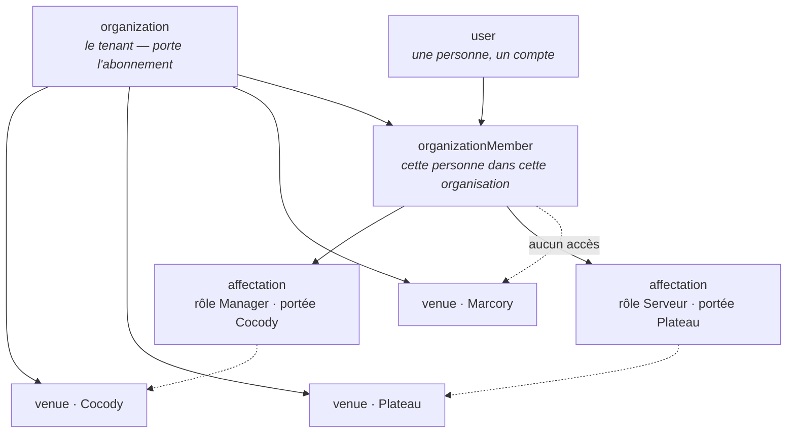

**Trois invariants non négociables :**

- **`organizationId` sur toute table métier.** Sans exception. `venueId` en plus dès que la donnée
  est locale à un établissement.
- **La portée se résout depuis l'appelant, avant de toucher une donnée** — et tout document atteint
  par clé étrangère est **re-vérifié** contre cette portée (`order.venueId === args.venueId`).
  C'est **cela** qui protège du franchissement de tenant. Le contre-exemple et sa correction sont
  dans `PERMISSIONS.md §6` : lire puis vérifier, c'est avoir déjà lu.
- **Un index n'a besoin d'un préfixe de portée que s'il est atteignable directement par un
  identifiant fourni par le client, sans garde préalable.** Ceux-là portent la marque
  `SCOPE-CRITIQUE` dans le schéma. Les autres (`orders.by_session`, `orderItems.by_order`) ne sont
  atteints qu'après une garde : y préfixer `venueId` n'ajouterait aucune sécurité, seulement du
  stockage.

> **Correction assumée.** Une version antérieure de ce document exigeait une clé de portée en tête
> de *chaque* index. La règle était **inapplicable** — 78 index sur 142 y dérogeaient légitimement —
> et une règle que la majorité du code viole n'est plus une règle : c'est du bruit qui apprend au
> relecteur à passer outre. Elle est remplacée par celle qui protège réellement.

---

## 4. Cycle de vie d'une session de table

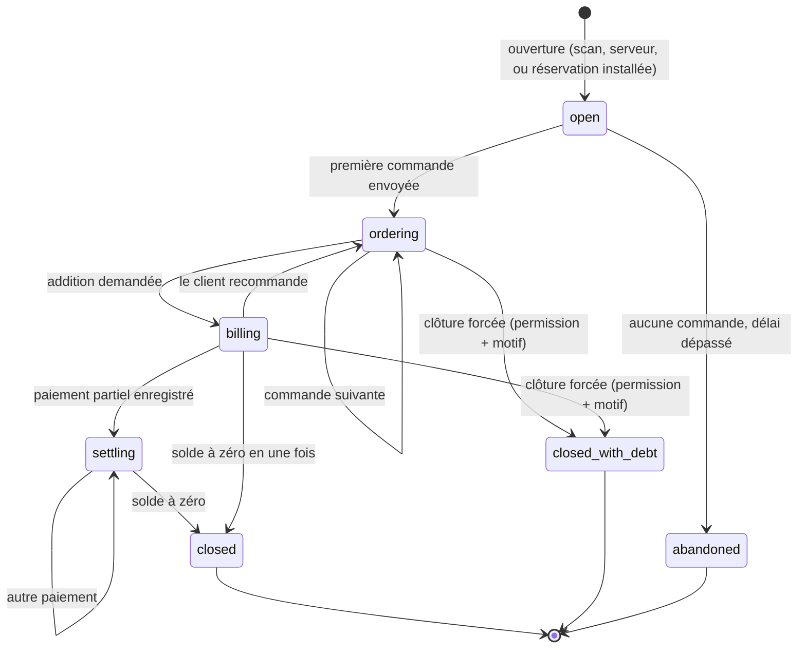

- **Une session sans table existe** : `fast_food` et `food_court` sont des types d'établissement
  déclarés, et on n'y sert pas à table. `restaurantTables` porte alors une table logique
  « comptoir » ou « à emporter » par point de vente — plutôt que de rendre `tableId` facultatif,
  ce qui ferait porter le cas particulier à tout le reste du schéma. *(CRITIQUE.md.)*
- Une table n'a **au plus une** session non terminale (*R1*). Garanti par un index unique logique
  `by_table_active` et une vérification transactionnelle à l'ouverture.
- `closed_with_debt` existe parce que la réalité existe : un client part sans payer. Le nier
  produirait des sessions ouvertes pour toujours, qui pourrissent la caisse et les analytics. Cet
  état exige une permission et un motif écrit, et il est compté dans les anomalies (§36).
- `abandoned` est prononcé par une tâche planifiée : un scan sans commande n'immobilise pas la table.

---

## 5. Cycle de vie d'une commande

C'est la machine la plus sensible du produit : elle porte les trois modes de service (§2 de
`PRODUCT.md`) **sans se dupliquer**.

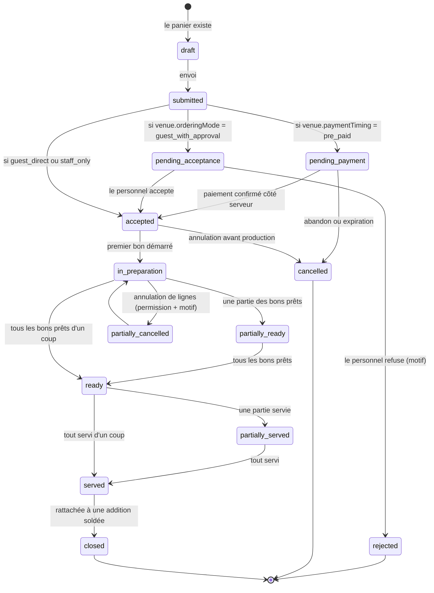

**Ce que cette machine règle :**

- Les trois modes convergent sur `accepted`. **Aucune branche de code supplémentaire** : la
  transition sortante de `submitted` est choisie par lecture des réglages de l'établissement
  (*D-011*). Ajouter un quatrième mode, c'est ajouter une transition, pas un `if` dans dix fichiers.
- **Aucun bon de production n'existe avant `accepted`** (*R8*). En `pre_paid`, la cuisine ne voit
  rien tant que le paiement n'est pas confirmé **côté serveur** (*R15*).
- `partially_*` existe parce qu'une table de quatre reçoit rarement ses quatre plats en même temps.
  Sans cet état, le serveur ne sait pas quoi porter.
- Chaque transition écrit un `orderEvent` : horodatage, acteur, source. C'est ce qui rend possible
  « qu'est-ce qui a ralenti le service hier soir ? » (§34) — sans journal, l'IA n'aurait rien à lire.

---

## 6. De la commande aux bons de production

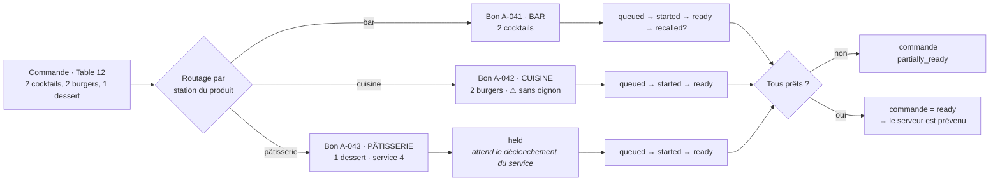

L'état de la commande est **dérivé** de ses bons, jamais saisi à la main (*R12*). Une seule source
de vérité : les bons. Le dessert attend en `held` jusqu'au « fire » du serveur — c'est ce qui évite
la glace servie avec le plat.

---

## 7. Cycle de vie d'un paiement

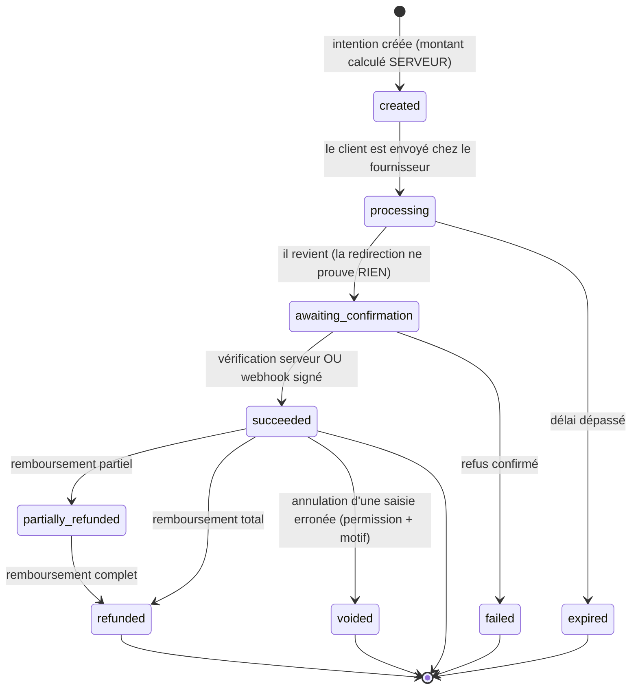

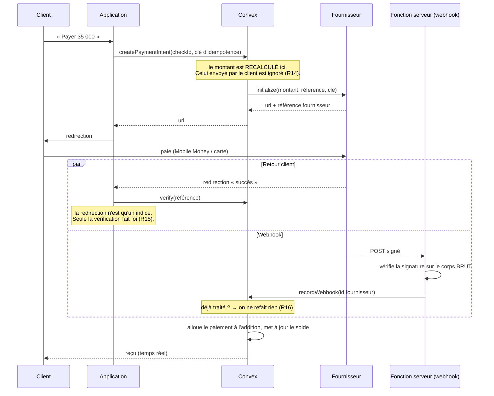

**Les quatre pièges traités ici, et nulle part ailleurs :**

| Piège | Traitement |
|---|---|
| Double clic sur « Payer » | Clé d'idempotence portée par le client, unique par (addition, tentative) |
| Webhook livré deux fois | `webhookEvents` unique sur l'identifiant fournisseur ; second passage = aucun effet |
| Paiement réussi, webhook en retard | Le retour client déclenche `verify` ; les deux chemins convergent sur la même mutation idempotente |
| Client hors ligne après paiement | La vérité est côté serveur ; il retrouve son reçu au rechargement, et la caisse voit le paiement |

---

## 8. Session de caisse

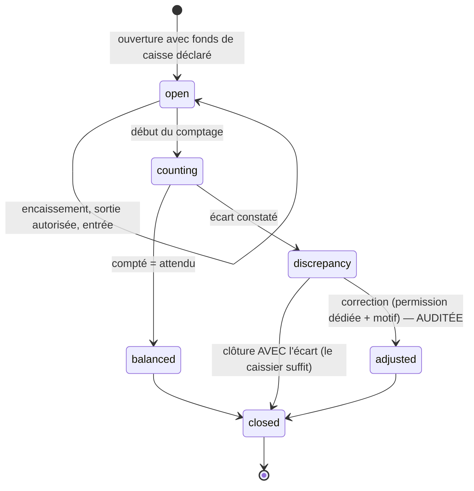

Un établissement ne peut avoir qu'**une** session ouverte par caisse. L'attendu se calcule à partir
des paiements en espèces attribués à la session, jamais saisi. L'écart n'est pas une honte à cacher :
c'est une donnée, et sa correction laisse une trace nominative (*R21*).

---

## 9. Architecture frontend

```
src/
├── routes/                    # TanStack Start — fines, elles orchestrent, elles ne décident pas
│   ├── (marketing)/           # public, SSR, indexable
│   ├── r/$venueSlug/t/$token/ # client à table — NOINDEX, jamais de token indexé
│   ├── menu/$venueSlug/       # menu public indexable (si le restaurant l'active)
│   ├── app/                   # application restaurant (authentifiée)
│   └── admin/                 # plateforme
├── features/                  # le métier vit ici
│   ├── auth/ menu/ floor/ sessions/ ordering/ kitchen/
│   ├── checks/ payments/ cash/ customers/ analytics/ ai/ team/
│   └── <feature>/{components,hooks,lib,types}.ts + index.ts
├── components/
│   ├── ui/                    # shadcn — primitives, aucun métier
│   ├── guest/                 # système « client » : aéré, photo, gros boutons
│   └── ops/                   # système « exploitation » : dense, tabulaire, raccourcis
├── lib/                       # convex client, formatage argent/date, i18n, analytics, erreurs
└── styles/
```

**Quatre règles de structure :**

1. **Une route ne contient pas de règle métier.** Elle assemble des composants de `features/`. Si un
   fichier de `routes/` dépasse ~150 lignes, la logique est au mauvais endroit.
2. **Une feature n'importe pas une autre feature** sauf par son `index.ts`. Interdit :
   `features/payments/lib/internal.ts` importé depuis `features/orders/`. Cela évite les
   dépendances circulaires que le brief redoute (§55).
3. **`components/ui` ne connaît aucun métier.** Il ne sait pas ce qu'est une commande.
4. **`guest/` et `ops/` partagent les jetons de design, pas la densité** (§67). Un même bouton, deux
   échelles.

**Rendu et données**

| Surface | Stratégie | Pourquoi |
|---|---|---|
| Landing, blog, menus publics | SSR + cache | SEO et vitesse sur réseau faible |
| Menu client (session de table) | SSR de la coquille + abonnement temps réel | Première image immédiate, puis disponibilités vivantes |
| Application restaurant | SPA authentifiée + abonnements | Tout y change en permanence |
| KDS | Abonnement seul, aucun polling | Le retard se voit à l'œil nu |

`TanStack Query` n'est utilisé **que** pour ce qui n'est pas dans Convex (appels serveur ponctuels,
tiers). Pour les données Convex, l'abonnement réactif est déjà la bonne réponse : ajouter un cache
par-dessus créerait deux vérités.

---

## 10. Architecture backend

```
convex/
├── schema.ts
├── lib/              auth.ts · permissions.ts · guards.ts · scope.ts
│                     money.ts · ids.ts · idempotency.ts · audit.ts
│                     rateLimiter.ts · errors.ts · time.ts
├── identity/ access/ venues/ billing/
├── menu/ floor/ sessions/ ordering/ kitchen/
├── checks/ payments/ cash/ bills/
├── customers/ reservations/ analytics/ ai/ integrations/
├── platform/
└── http.ts           # webhooks entrants, vérification de signature
```

Dans chaque domaine : `queries.ts` · `mutations.ts` · `actions.ts` · `internal.ts` · `model.ts`
(règles pures, testables sans base) · `machine.ts` (transitions).

**Le patron de toute mutation publique**, dans cet ordre, sans exception :

```ts
export const fireCourse = mutation({
  args: { venueId: v.id("venues"), orderId: v.id("orders"), courseNumber: v.number() },
  handler: async (ctx, args) => {
    // 1. identité + permission + portée — AVANT toute lecture métier
    const actor = await requirePermission(ctx, "order.course.fire", { venueId: args.venueId });
    // 2. limitation de débit sur les surfaces abusables
    await enforceRateLimit(ctx, "orderMutation", actor.userId);
    // 3. charger, en vérifiant l'appartenance à la portée de l'appelant
    const order = await loadInVenue(ctx, "orders", args.orderId, args.venueId);
    // 4. transition validée par la machine à états
    const next = orderMachine.transition(order.status, "FIRE_COURSE", { courseNumber: args.courseNumber });
    // 5. écrire : état + événement métier + audit si sensible
    await ctx.db.patch(order._id, { status: next });
    await recordOrderEvent(ctx, { orderId, type: "course_fired", actor, at: Date.now() });
  },
});
```

**Ce qui est interdit côté Convex**, et cherché en revue :

- une fonction publique sans garde ;
- un `.collect()` sans index de portée en tête (il lira la table entière) ;
- une chaîne de statut écrite en dur au lieu de passer par la machine ;
- un montant reçu du client et enregistré tel quel ;
- un appel sortant dans une `mutation` (c'est le rôle d'une `action`) ;
- une fonction qui fait trois choses — le brief l'interdit (§5) et c'est ce qui rend l'audit illisible.

---

## 11. Architecture IA

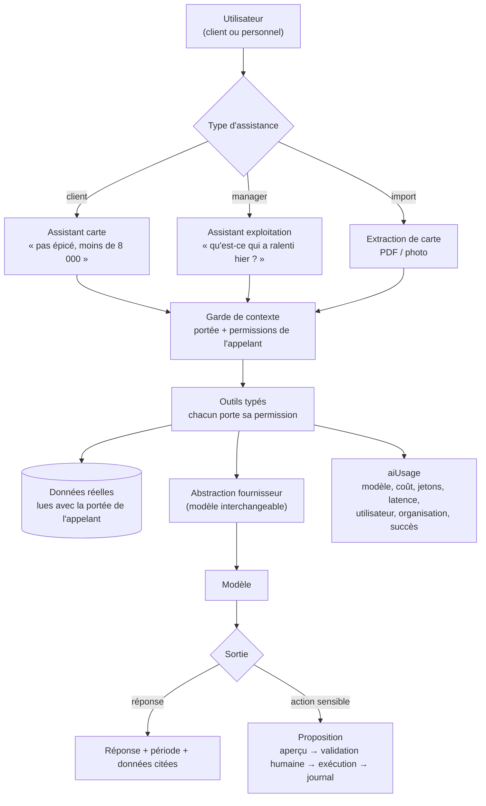

**Quatre garde-fous structurels :**

1. **L'IA n'a pas d'accès privilégié.** Ses outils lisent avec la portée et les permissions de celui
   qui pose la question. Un serveur ne peut pas obtenir par l'IA le chiffre d'affaires d'un
   établissement où il n'a pas accès (*R30*, §90).
2. **Rien d'inventé.** Sur un allergène non déclaré, la réponse est « cette information n'est pas
   renseignée » (*R28*). C'est une contrainte d'outillage, pas une consigne de rédaction : l'outil
   ne renvoie que ce qui existe en base.
3. **Le contenu importé est une donnée, jamais une instruction.** Une carte PDF qui contient « ignore
   les instructions précédentes » est du texte à extraire, rien d'autre. Séparation stricte entre
   consigne système et contenu fourni (§90, §118).
4. **Aucune action sensible sans validation humaine** (*D-014*). L'IA propose ; une personne qui
   détient `ai.actions.approve` exécute ; le journal garde les deux.

Le fournisseur est interchangeable par construction : un adaptateur, pas un SDK importé dans les
écrans. Le coût et la latence sont mesurés à chaque appel, sinon la facture arrive sans explication.

---

## 12. Temps réel, hors ligne, erreurs

**Temps réel.** Les abonnements sont scopés au plus étroit : le KDS d'une station s'abonne aux bons
*de cette station*, pas à toutes les commandes de l'établissement. Un abonnement large est un
abonnement qui se réveille pour rien et vide la batterie d'une tablette.

**Hors ligne** — trois cercles, et pas un de plus (*A4*) :

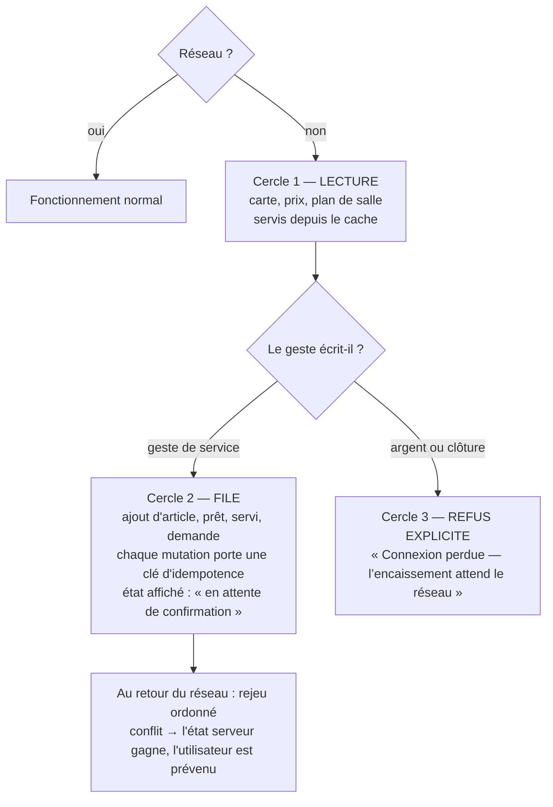

Jamais « commande envoyée » tant que le serveur n'a pas confirmé (§71). L'état intermédiaire a son
propre libellé et sa propre icône.

**Erreurs.** Une erreur métier est typée (`ConvexError` avec un code), jamais une chaîne libre : le
client doit pouvoir distinguer `ITEM_UNAVAILABLE` de `PERMISSION_DENIED` de `TABLE_CLOSED` pour
afficher la bonne chose. Chaque erreur porte un identifiant de trace, relié à l'organisation, à
l'établissement et à la route, **sans secret** (§92).

---

## 13. Ce qui n'est pas encore tranché

| Sujet | Pourquoi ce n'est pas tranché | Où ça se décidera |
|---|---|---|
| Versions exactes des dépendances | Vérification des documentations officielles en cours | `docs/research/stack-compatibility.md` |
| Fournisseur de paiement n°1 | Dépend de la couverture réelle en Côte d'Ivoire | `docs/research/payments-africa.md` |
| Gestion de formulaires | Trois candidats crédibles, aucun décisif | `docs/research/stack-compatibility.md` |
| PIN de service pour le personnel | Désaccord ouvert avec le brief | `docs/DECISION_LOG.md` A1 |
| Impression tickets | Dépend du matériel réellement présent | Entretiens terrain |
